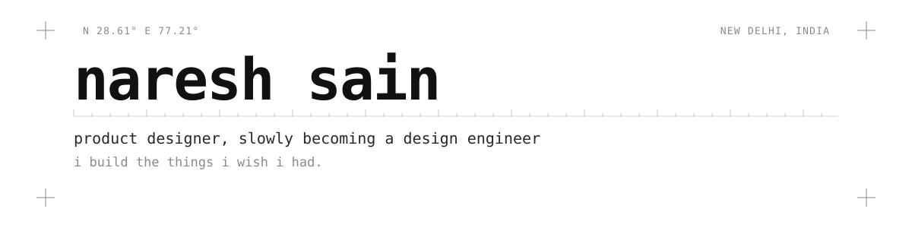
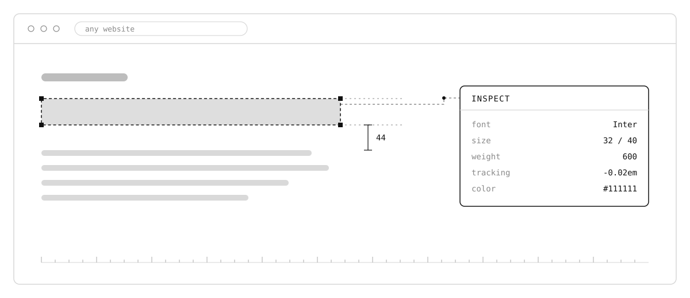
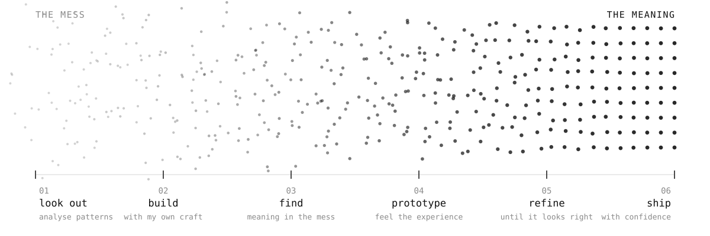

  

<picture>
  <source media="(prefers-color-scheme: dark)" srcset="./assets/hero-dark.svg">
  <source media="(prefers-color-scheme: light)" srcset="./assets/hero-light.svg">
  
</picture>

  
  
  
  

---

### now

product design at **Basik Marketing**, mostly shipping **[The Esports Club](https://theesports.club)**'s platform,
with oversight on TEC Spartan and internal tools.

the rest of my time goes into ai workflows, interaction, and code prototyping —
figuring out where the design work ends and the building starts. turns out it doesn't.

last updated september 2026

---

### things i build

nobody asked for this. i wanted it to exist.

#### [design-tool](https://github.com/shadezie/design-tool)

figma-style inspection for any website — type styles, spacing, and element
measurement, right in chrome.

  <picture>
    <source media="(prefers-color-scheme: dark)" srcset="./assets/inspect-dark.svg">
    <source media="(prefers-color-scheme: light)" srcset="./assets/inspect-light.svg">
    
  </picture>

---

### how i work

  <picture>
    <source media="(prefers-color-scheme: dark)" srcset="./assets/process-dark.svg">
    <source media="(prefers-color-scheme: light)" srcset="./assets/process-light.svg">
    
  </picture>

most of my work starts messy. then i find the meaning in it.
everything has a meaning — all you need is the eye of a designer.

---

### stack

  
  
  
  
  
  
  
  
  

---

### the grid

  <picture>
    <source media="(prefers-color-scheme: dark)" srcset="https://raw.githubusercontent.com/shadezie/shadezie/output/snake-dark.svg">
    <source media="(prefers-color-scheme: light)" srcset="https://raw.githubusercontent.com/shadezie/shadezie/output/snake-light.svg">
    
  </picture>

every square is something that didn't work the first time.

---

<h3 align="center">let's talk</h3>

  open to conversations about design engineering, interaction, 
  and tools that shouldn't exist yet.

  

  <i>built by me, obviously.</i>

